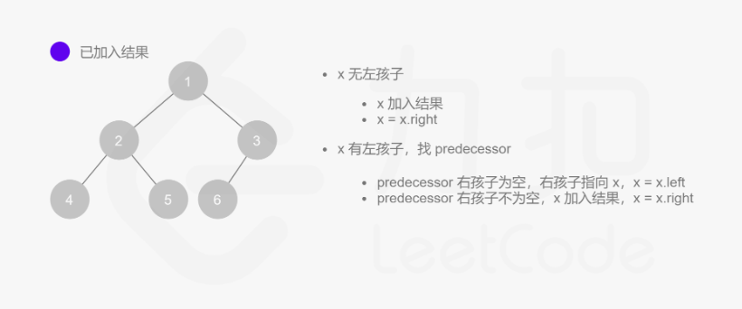

# Hot100 T94 二叉树的中序遍历

递归写法：
```python
# Definition for a binary tree node.
# class TreeNode(object):
#     def __init__(self, val=0, left=None, right=None):
#         self.val = val
#         self.left = left
#         self.right = right
class Solution(object):
    def inorderTraversal(self, root):
        """
        :type root: Optional[TreeNode]
        :rtype: List[int]
        """
        if not root:
            return []
        return self.inorderTraversal(root.left) + [root.val] + self.inorderTraversal(root.right)
```

用栈模拟：
```python
class Solution(object):
    def inorderTraversal(self, root):
        """
        :type root: Optional[TreeNode]
        :rtype: List[int]
        """
        res = []
        stack = []
        while root or stack:
            while root:
                stack.append(root)
                root = root.left
            root = stack[-1]
            res.append(root.val)
            stack.pop()
            root = root.right
        return res
```

Morris遍历：看图理解 or 背步骤

```python
class Solution(object):
    def inorderTraversal(self, root):
        """
        :type root: Optional[TreeNode]
        :rtype: List[int]
        """
        res = []
        while root:
            if not root.left:
                res.append(root.val)
                root = root.right
            else:
                pre = root.left
                while pre.right and pre.right != root:
                    pre = pre.right
                if pre.right:
                    res.append(root.val)
                    root = root.right
                else:
                    pre.right = root
                    root = root.left
        return res